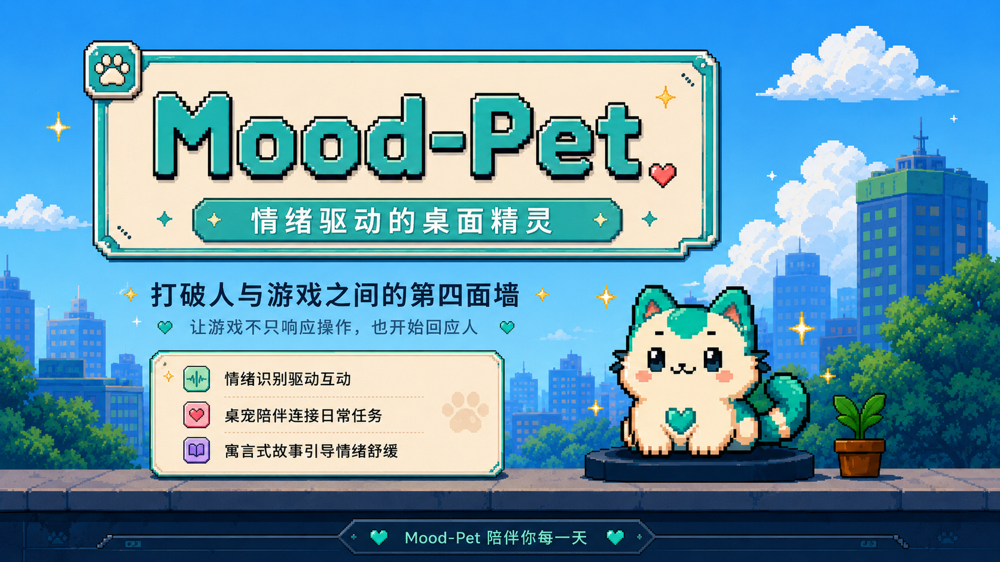

# Mood-Pet：情绪驱动的桌面精灵

<p align="center">
  
  
  
  
</p>



> 让游戏不只响应操作，也开始回应人。

Mood-Pet 是一款基于人脸情绪识别的智能桌面精灵。它不是单纯“更可爱的桌宠”，而是通过本地状态感知、主动气泡、待办任务和情绪互动故事，把用户屏幕前的真实状态转化为新的交互输入。

过去，游戏只能响应鼠标、键盘和用户操作；现在，Mood-Pet 让桌面角色开始感知用户状态，并根据用户当下的情绪、节奏和任务场景生成对应反馈。它的核心创新是：用情绪识别打破人与游戏之间的第四面墙，让角色真正“看见”屏幕前的人。

## 项目入口

主要应用代码位于：

```text
desktop-pet-master/
```

完整项目说明、运行方式、功能介绍和技术链路请查看：

```text
desktop-pet-master/README.md
```

## 核心功能

- 情绪识别算法：基于摄像头画面进行本地人脸检测与情绪识别。
- 桌面精灵：常驻桌面的轻量角色，支持拖拽、动画和右键菜单。
- 实时检测：展示当前识别状态、置信度和摄像头状态。
- 主动气泡：根据用户状态生成短句提醒，并可跳转到对应功能。
- 待办功能：进入真实学习和办公场景，用更柔和的方式推动行动。
- 情绪互动故事小游戏：根据用户状态生成隐喻式故事体验。
- 设置与隐私控制：支持摄像头开关、气泡频率、免打扰和跳转目标配置。
- 大模型辅助内容：可接入 DeepSeek / 火山方舟等服务生成气泡文案与故事素材。

## 核心优势

Mood-Pet 的关键价值不是“桌面上有一个角色”，而是角色能够根据人的实时状态改变反馈方式。

```text
键盘 / 鼠标 + 本地情绪识别
        ↓
桌宠反馈 + 主动气泡 + 待办提醒 + 情绪互动故事
```

它把情绪作为新的交互输入，让游戏内容、宠物台词、待办提醒和故事节点都能围绕用户此刻的状态发生变化。

## 情绪算法

Mood-Pet 的情绪算法并不是把模型结果简单展示给用户，而是做了一层适合桌面陪伴场景的状态优化。

```text
摄像头采集
  → 人脸检测
  → 人脸区域标准化
  → OpenVINO 情绪模型推理
  → 情绪分数归一化
  → Mood-Pet 状态语义映射
  → 桌宠行为决策 / 气泡反馈 / 故事节点
```

系统会把底层识别标签转化为更适合产品表达的情绪状态，并继续参与气泡策略、待办提醒和故事生成。这样情绪识别不只是一个检测结果，而是驱动交互变化的核心输入。

## 快速开始

```powershell
cd desktop-pet-master
python -m venv .venv
.\.venv\Scripts\activate
pip install PyQt5 opencv-python numpy openvino pytest
copy .env.example .env
python main.py
```

## 一句话

Mood-Pet 想做的不是一个更可爱的桌宠，而是一个真正能感知用户状态的桌面伙伴。
